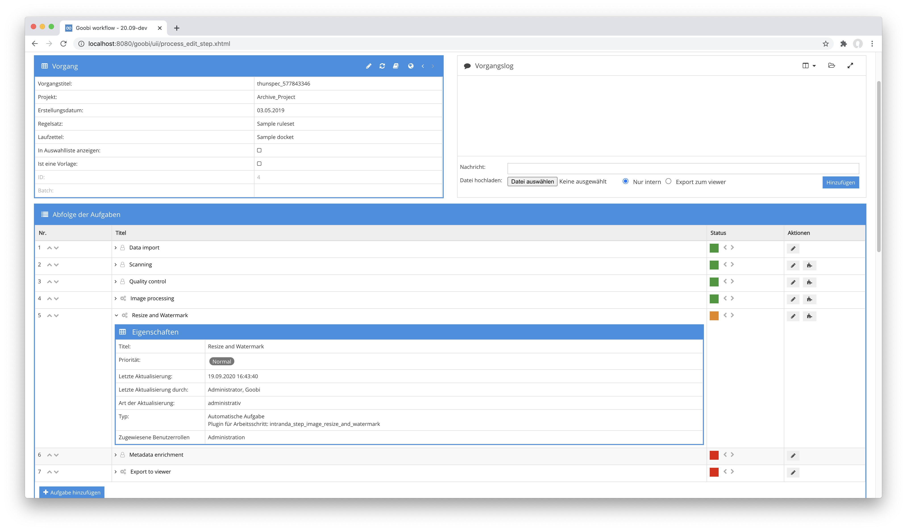

## Einführung
Dieses Plugin erlaubt es, Bilder auf eine maximale Größe zu skalieren und anschließend Wasserzeichen in die zuvor skalierten Bilder zu rendern. Dabei ist die maximale Größe sowie das zu rendernde Wasserzeichen flexibel konfigurierbar.


## Installation
Zur Installation des Plugins muss folgende Datei installiert werden:

```bash
/opt/digiverso/goobi/plugins/step/plugin_intranda_step_image_resize_and_watermark-base.jar
```

Für die korrekte Ausführung des Plugins wird außerdem eine Konfigurationsdatei benötigt:

```bash
/opt/digiverso/goobi/config/plugin_intranda_step_image_resize_and_watermark.xml
```

Darüber hinaus wir auf dem System ebenfalls noch eine erfolgreiche Installation der folgenden beiden Pakete vorausgesetzt:

```bash
ImageMagick
GraphicsMagick
```

Beide Pakete sind in gängigen Paketmanagern enthalten und können daraus unkompliziert installiert werden.


## Überblick und Funktionsweise
Zur Inbetriebnahme des Plugins muss dieses für einen oder mehrere gewünschte Aufgaben im Workflow aktiviert werden. Dies erfolgt durch Auswahl des Plugins `intranda_step_image_resize_and_watermark` aus der Liste der installierten Plugins.



Nach Ausführung des Plugins haben die Bilder die erwartete Größe und verfügen über das konfigurierte Wasserzeichen.


## Konfiguration
Die Konfiguration des Plugins erlaubt es festzulegen, auf welche Maximalgröße die Bilder skaliert werden sollen, sowie welches Wasserzeichen (Bilder und auch Text-Wassserzeichen werden unterstützt) gerendert werden soll. Auch die Positionierung des Wasserzeichens kann individuell festgelegt werden. Dafür sind mehrere Konfigurationen möglich, die anhand des Projektes, des Names für den Arbeitsschritt innerhalb des Workflows, der digitalen Kollektion sowie eines Medientyps (spezielles Metadatum innerhalb der METS-Datei des jeweiligen Vorgangs) unterschieden werden. Bei der Ausführung des Plugins wird die erste Konfiguration verwendet, die zum aktuell bearbeiteten Vorgang passt.

Bitte beachten Sie, dass im oberen Bereich der Konfiguration außerdem die korrekten Pfade für GraphicMagick und ImageMagick angegeben werden müssen.

Eine Beispielkonfiguration für die Datei `plugin_intranda_step_image_resize_and_watermark.xml` sieht folgendermaßen aus:

```xml
<config_plugin>
    <!-- path to GraphicsMagick -->
    <gmPath>/usr/bin/gm</gmPath>
    <!-- path to ImageMagick -->
    <convertPath>/usr/bin/convert</convertPath>
    <!--
        order of configuration is:
          1.) project name and step name matches
          2.) step name matches and project is *
          3.) project name matches and step name is *
          4.) project name and step name are *
    -->
    <config>
        <!-- which projects to use for (can be more than one, otherwise use *) -->
        <project>*</project>
        <step>*</step>

        <!-- the source directory from which the images will be taken -->
        <sourceDir>cropped</sourceDir>
        <!-- the destination directory where the scaled and watermarked images will reside -->
        <destDir>media</destDir>

        <!-- only use this block with processes in collection "mycollection"
             and with mediaType "book" -->
        <imageConfig collection="mycollection" mediaType="book">
            <!-- The maximum size of the longest side of an image -->
            <resizeTo>1500</resizeTo>
            <!-- The watermark configuration -->
            <watermark>
                <!-- the image to use for watermarking -->
                <image>/opt/digiverso/goobi/xslt/logo.png</image>
                <!-- define the shade size here -->
                <shadeSize>240x40</shadeSize>
                <!-- the location of the watermark. Possible values: north,
                     northeast, east, southeast, south, southwest,
                     west, northwest -->
                <location>southeast</location>
                <!-- these are the distances to the edges on the x- resp. y-axis -->
                <xDistance>100</xDistance>
                <yDistance>100</yDistance>
            </watermark>
        </imageConfig>

        <!-- use this block with processes in collection "myothercollection"
             and any mediaType -->
        <imageConfig collection="myothercollection" mediaType="*">
            <resizeTo>1500</resizeTo>
            <watermark>
                <!-- you can also use a text-only watermark. -->
                <text>My watermark text</text>
                <!-- define the shade size here -->
                <shadeSize>240x40</shadeSize>
                <!-- define the size of the box for the text -->
                <boxSize>450x200</boxSize>
                <!-- font to use for the text rendering -->
                <font>Open-Sans</font>
                <location>southeast</location>
                <xDistance>600</xDistance>
                <yDistance>100</yDistance>
            </watermark>
        </imageConfig>

    </config>
</config_plugin>
```

Der Block `<config>` kann für verschiedene Projekte oder Arbeitsschritte wiederholt vorkommen, um innerhalb verschiedener Workflows unterschiedliche Aktionen durchführen zu können. Die weiteren Parameter innerhalb dieser Konfigurationsdatei haben folgende Bedeutungen:

| Wert | Beschreibung |
| :--- | :--- |
| `gmPath` | Pfad zur Installation von GraphicsMagick |
| `convertPath` | Pfad zur Installation von ImageMagick |
| `project` | Dieser Parameter legt fest, für welches Projekt der aktuelle Block `<config>` gelten soll. Verwendet wird hierbei der Name des Projektes. Dieser Parameter kann mehrfach pro `<config>` Block vorkommen. |
| `step` | Dieser Parameter steuert, für welche Arbeitsschritte der Block `<config>` gelten soll. Verwendet wird hier der Name des Arbeitsschritts. Dieser Parameter kann mehrfach pro `<config>` Block vorkommen. |
| `sourceDir` | Pfad zu dem Verzeichnis, das als Quellverzeichnis verwendet werden sollen. |
| `destDir` | Pfad zu dem Verzeichnis, in das die skalierten und mit Wasserzeichen versehenen Bilder gespeichert werden sollen. |
| `mediaType` | Einschränkung auf Vorgänge, deren Metadatum des Typs `Type` dem konfigurierten Wert entspricht. Alternativ kann `*` verwendet werden, um keine Einschränkung vorzunehmen. |
| `collection` | Einschränkung auf die Vorgänge, die einer ausgewählten digitalen Sammlung zugehören. |
| `resizeTo` | Maximale Größe des Bildes an der längsten Seite. Angabe in Pixeln. |
| `watermark/image` | Pfad zu einem Bild, das innerhalb des Wasserzeichens verwendet werden soll. |
| `watermark/shadeSize` | Definieren Sie hier, welche Größenangabe als shade verwendet werden soll. |
| `watermark/text` | Text, der innerhalb des Wasserzeichens verwendet werden soll. |
| `watermark/font` | Legen Sie hier fest, welche Schriftart für den Text verwendet werden soll. Diese Schriftart muss auf dem System installiert sein. |
| `watermark/boxSize` | Definieren Sie hier, welche Maße die Box haben soll, innerhalb der der Text gerendered werden soll. Dies bestimmt somit die Größe der dargestellten Schrift. |
| `watermark/location` | Festlegung, an welcher Stelle innerhalb des Bildes das Wasserzeichen gerendert werden soll. Mögliche Angaben sind `north`, `northeast`, `east`, `southeast`, `south`, `southwest`, `west`, `northwest` |
| `watermark/xDistance` | Seitlicher Abstand des Wasserzeichens |
| `watermark/yDistance` | Abstand des Wasserzeichens  nach oben bzw. unten |
